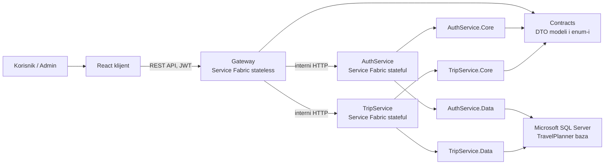

# Arhitektura sistema

Gateway je jedini javni backend ulaz. AuthService i TripService su odvojeni stateful servisi sa internim HTTP endpointima. DTO modeli su u `Contracts`, modeli baze i DbContext klase su u `*.Data` projektima, a poslovna logika je u `*.Core` projektima.
