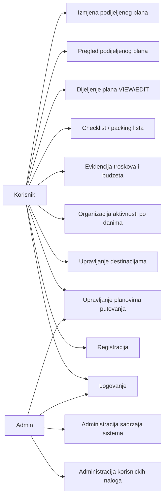

# Use Case dijagram

```mermaid
flowchart LR
    User["Korisnik"]
    Admin["Admin"]

    Register["Registracija"]
    Login["Logovanje"]
    ManageTrips["Upravljanje planovima putovanja"]
    ManageDestinations["Upravljanje destinacijama"]
    ManageActivities["Organizacija aktivnosti po danima"]
    ManageExpenses["Evidencija troskova i budzeta"]
    ManageChecklist["Checklist / packing lista"]
    ShareTrip["Dijeljenje plana VIEW/EDIT"]
    ViewShared["Pregled podijeljenog plana"]
    EditShared["Izmjena podijeljenog plana"]
    AdminUsers["Administracija korisnickih naloga"]
    AdminContent["Administracija sadrzaja sistema"]

    User --> Register
    User --> Login
    User --> ManageTrips
    User --> ManageDestinations
    User --> ManageActivities
    User --> ManageExpenses
    User --> ManageChecklist
    User --> ShareTrip
    User --> ViewShared
    User --> EditShared
    Admin --> Login
    Admin --> AdminUsers
    Admin --> AdminContent
    Admin --> ManageTrips
```

VIEW share token omogucava samo pregled plana. EDIT share token omogucava izmjenu podataka koji su dozvoljeni na backend-u, uz validaciju tokena i isteka pri svakom zahtjevu.
